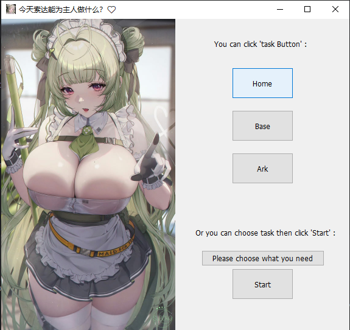
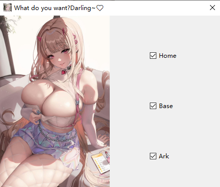

参照[auto_player](https://github.com/anywhere2go/auto_player)和[NIKKE-helper](https://github.com/gdxxp/NIKKE-helper/tree/main)的仓库的大佬写的，因为是边学边做，所以写得会比较详细（鞠躬）。

## 文件夹：
- ocr: 使用ocr_main运行，与opencv无关，有单独的requirements.txt
- screen：screen_shot函数第二个argument可以引入文件名，将截图保存在screen中
- image：ui界面的图片
- **wanted**：用作opencv识别（主要文件夹）

## 文件：
- auto_task.py: 改版后的版本，可以直接运行
- ui.py: 是ui界面相关文件
- main.py: ui与功能的结合
- opencv.py: 是脚本的基本算法

## 注意：
- OCR模式不适合NIKKE，因为很多选项不是文字而是图标
- 文件路径不要有中文
- 游戏窗口需要在前台
- 用管理员权限打开CMD来运行程序

## 预览:

## 运行：
- 下载到本地
- pip install -r requirement.txt下载相关依赖
- 运行main